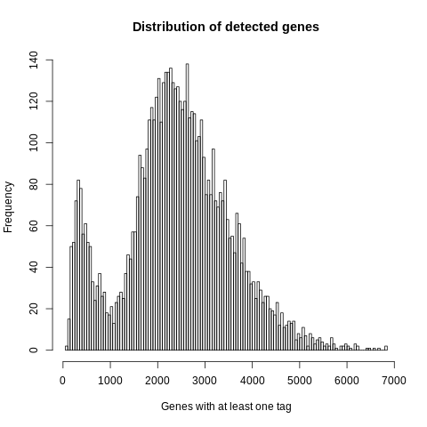

=========================================================================================================================
**D: UMITool based general plots before filtering**
=========================================================================================================================

.. figure:: Dplot_cell_barcode_counts.png  
  :width: 800px
  :align: center 
  :height: 400px
  :alt: Cell Barcode Counts

.. figure:: Dplot_cell_barcode_count_density.png
   :width: 800px 
   :align: center 
   :height: 400px
   :alt: Density 

