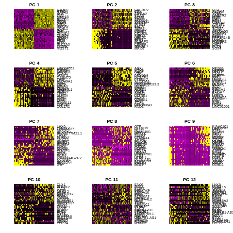

==============================================================================
**E: Cell Ranger/Seurat - Cells with genes <1500 and > 3500  are filtered**
==============================================================================

.. ::  

  

    Before Normalization 

    After Normalization 

    Dispersion

  
   PCA for sample E

   TSNE Clustering 

   Heatmap of sample E

 
   Heatmaps of PCAs of sample E

  
   VNPlot for selected genes 

   Feature Plot for selected genes 

   
   VNPlot for top Marker genes 

 
   Feature Plot for top Marker genes 
   

