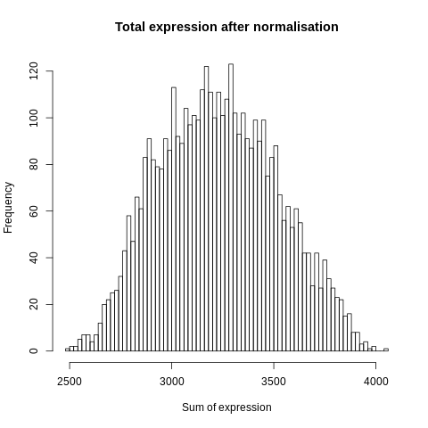
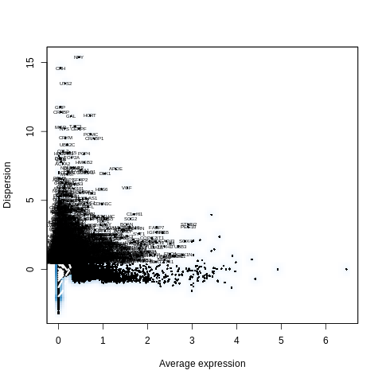
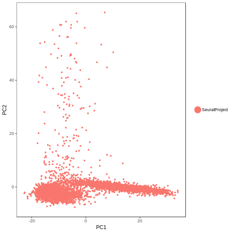
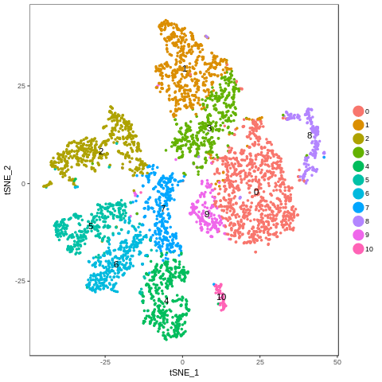
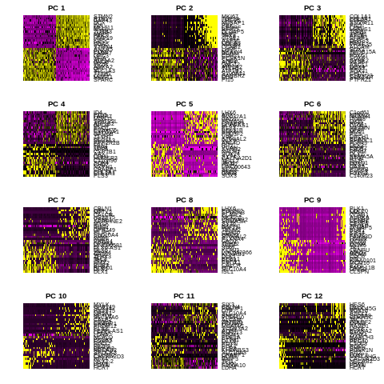
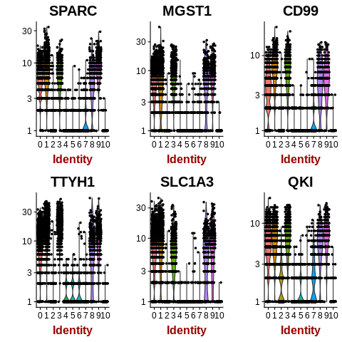
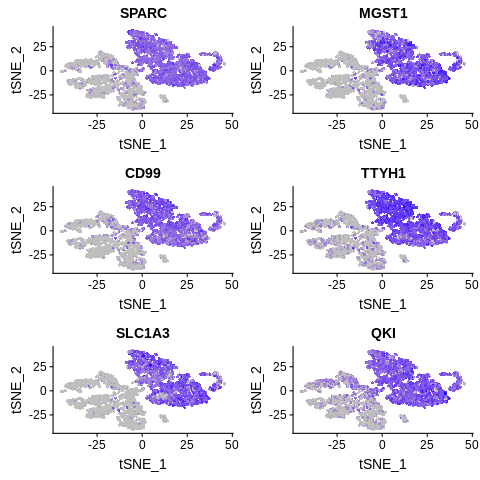
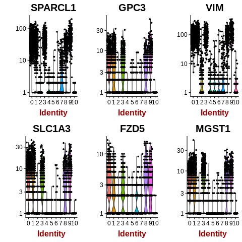
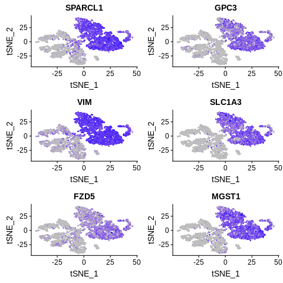

================================================================================================================
**F: UMI/Seurat -  Cells with genes <1700 and > 3700are filtered** 
================================================================================================================

.. figure:: fumi1700.before.hist.png
    :width: 500px
    :align: center
    :height: 500px
    :alt: Before Normalization
    :figclass: align-center

    Before Normalization 

    After Normalization 

    Dispersion

  
   PCA for sample F

   TSNE Clustering 

.. figure:: fumi1700.heatmap1.png 
   :width: 600px
   :align: center 
   :height: 600px 
   :alt: Heatmap of Sample F 
   :figclass: align-center

   Heatmap of sample F

 
   Heatmaps of PCAs of sample F

  
   VNPlot for top PCA genes 

   Feature Plot for top PCA genes 

   
   VNPlot for top Marker genes 

 
   Feature Plot for top Marker genes 
   
