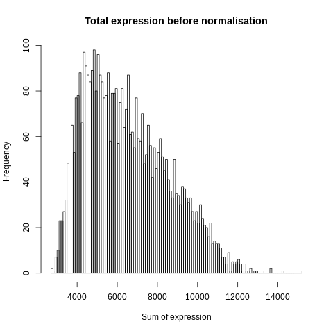
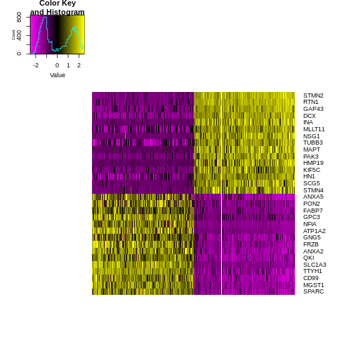

================================================================================================================
**F: UMI/Seurat -  Cells with genes <1700 and > 3700are filtered** 
================================================================================================================

    Before Normalization 

    After Normalization 

    Dispersion

  
   PCA for sample F

   TSNE Clustering 

   Heatmap of sample F

 
   Heatmaps of PCAs of sample F

  
   VNPlot for top PCA genes 

   Feature Plot for top PCA genes 

   
   VNPlot for top Marker genes 

 
   Feature Plot for top Marker genes 
   
