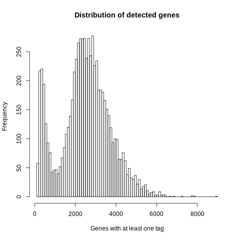
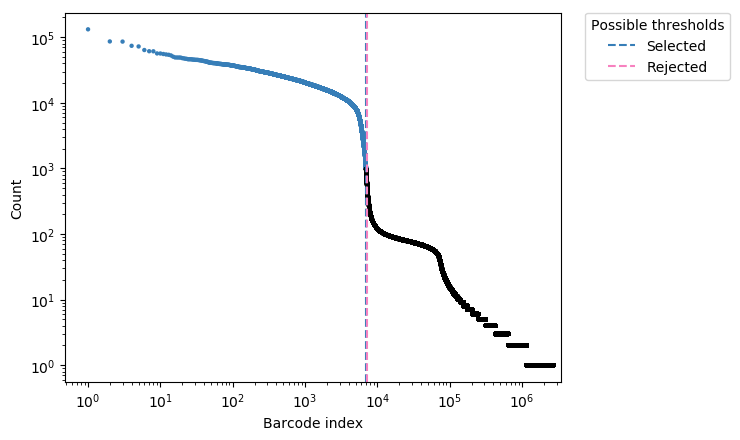
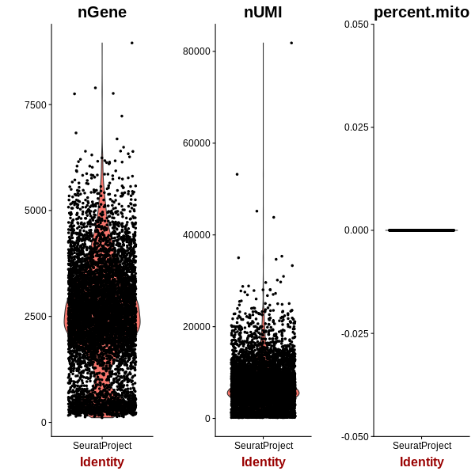

=======================================================================================================================
**G: UMITool based general plots before filtering**
=======================================================================================================================

.. figure:: gumi.sumexpression.png 
   :width: 500px
   :align: center 
   :height: 500px
   :alt:  Expression sum per cell 

.. figure:: Gplot_cell_barcode_count_density.png
   :width: 800px 
   :align: center 
   :height: 400px
   :alt: Density 

